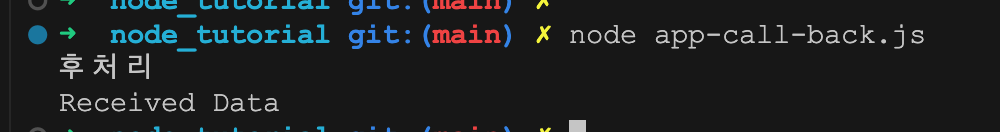
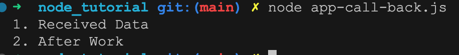
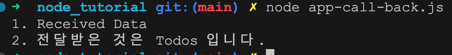
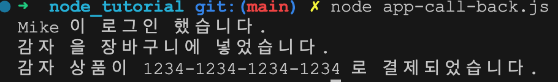

# [javascript 기초] Callback 프로그램

Tags: basic, blog, javascript
Created: 2024년 7월 28일 오후 1:37
Updated: 2024년 7월 29일 오전 7:47
URL: https://www.youtube.com/watch?v=D7k6ld19v9M&t=10s

## 함수형 프로그램

1. 콜백 프로그램
    
    > 비동기 프로그램에서 아래와 같이 순차로 호출하게 되면
    > 
    
    1. 후처리가 먼저 나올 수 있게 만들기
        1. 기본 호출 형태
        
        ```jsx
        function getData(){
        	setTimeout(()=>{
        		console.log('Received Data');
        	}, 2000);
        }
        
        getData();
        console.log('후처리')
        ```
        
        
        
    
    b. 순서 보장 하기.
    
    ```jsx
    function getData(callback) {
    	setTimeout(()=>{
    		console.log('1. Received Data');
    		callback();
    	}, 2000);
    }
    
    getData(()=>{
    	console.log('2. After Work')
    });
    
    ```
    
    
    
    c. 데이터 전달 받기
    
    ```jsx
    function getData(callback) {
    	setTimeout(()=>{
    		console.log('1. Received Data');
    		callback({name: 'Todos'});
    	}, 2000);
    }
    
    getData((data)=>{
    	console.log(`2. 전달받은 것은 ${data.name} 입니다.` )
    });
    
    ```
    
    
    

1. 콜백프로그램 응용시나리오 
    
    > 로그인을 한다. ⇒ 장바구니에 물품을 넣는다. ⇒ 결제를 한다. 에 대한 프로그램 작성.
    > 
    1. 함수를 만든다.
        
        ```jsx
        // 1. 로그인
        function login(username, callback){
        	setTimeout(()=>{
        		callback(username);
        	}, 1000);
        }
        
        // login('Mike', (username)=>{
        // 	console.log(`${username} 님이 로그인 했습니다.`);
        // });
        
        // 2. 장바구니 넣기
        function addCart(item, callback){
        	setTimeout(()=>{
        		callback(item);
        	}, 1000);
        }
        
        // addCart('shoes', (item)=>{
        // 	 console.log(`${item}이 장바구니에 담겼습니다.`);
        //  });
        
        // 3. 결제하기
        function makePayment(cardNumber, product, callback){
        	setTimeout(()=>{
        		callback(cardNumber,product);
        	}, 1000);
        }
        
        ```
        
    2. 함수를 실행한다.
        
        ```jsx
        login('Mike', (username)=>{
        	console.log(`${username} 이 로그인 했습니다.`)
        	addCart('감자', (item)=>{
        		console.log(`${item} 을 장바구니에 넣었습니다.`)
        		makePayment('1234-1234-1234-1234', item, (cardNumber, product)=>{
        			console.log(`${product} 상품이 ${cardNumber} 로 결제되었습니다.`);
        		});
        	});
        });
        ```
        
        
        

참고 : 별코딩님 채널 ([https://www.youtube.com/watch?v=D7k6ld19v9M&t=10s](https://www.youtube.com/watch?v=D7k6ld19v9M&t=10s))